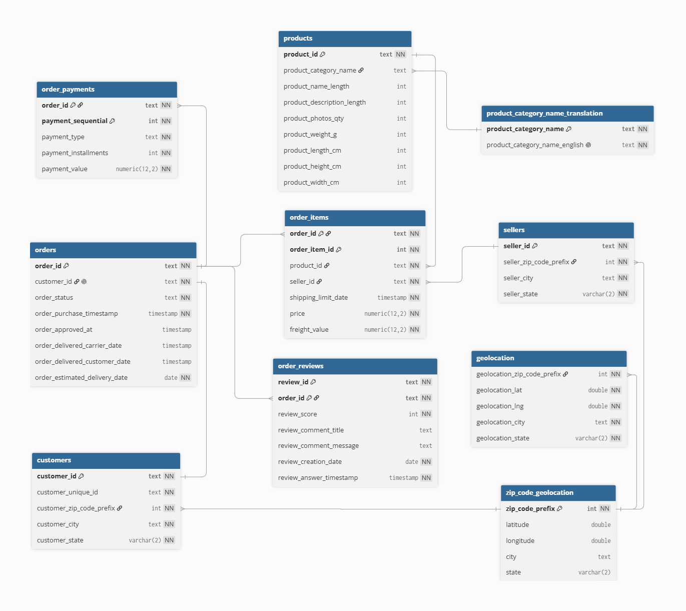

# Delivery Performance and Customer Satisfaction Analysis

An end-to-end data analytics project based on the Brazilian Olist
e-commerce dataset.

The project examines whether business growth is supported by reliable
delivery operations and a consistent customer experience. It focuses on
order and transaction growth, delivery reliability, fulfillment
bottlenecks, customer satisfaction, seasonal demand pressure, and the
potential relationship between delivery delays and repeat purchasing.

The original SQLite data is migrated to PostgreSQL, validated, cleaned,
and transformed before further analysis in SQL, Python, and Power BI.

## Project Objectives

The main goals of the project are to:

- evaluate business growth through order volume and transaction value;
- measure delivery reliability and performance against promised delivery dates;
- identify operational bottlenecks across seller processing and carrier transportation;
- analyze how delivery delays are associated with customer satisfaction;
- identify high-volume sellers, product categories, and geographic markets
  with elevated delivery risk;
- evaluate the effect of seasonal demand peaks on delivery performance
  and customer experience;
- investigate whether customers who experience late delivery are less
  likely to make another purchase within a defined observation period.

## Business Questions

The analysis is structured around seven business questions:

1. **Is Olist's order volume and transaction value growing over time, and
   is delivery performance keeping pace with that growth?**

2. **How reliably does Olist meet its promised delivery dates, and how
   accurate are estimated delivery times?**

3. **How strongly do delivery delays affect customer satisfaction, and at
   what delay duration does customer sentiment deteriorate most sharply?**

4. **Which stage of fulfillment contributes most to delivery problems:
   seller processing or carrier transportation?**

5. **Which high-volume sellers, product categories, and geographic markets
   create the greatest combination of commercial importance and delivery risk?**

6. **How do seasonal demand peaks affect delivery reliability and customer
   satisfaction?**

7. **Are customers who experience late delivery less likely to purchase
   again within a defined observation window?**

## Technology Stack

- SQL
- Python
- Power BI
- Git

## Project Workflow

1. Migrate the original Olist SQLite database to PostgreSQL.
2. Validate the migrated source data.
3. Correct source schema issues and convert columns to appropriate
   PostgreSQL data types.
4. Create a cleaned ZIP-code-level geolocation lookup.
5. Add primary keys, foreign keys, constraints, and analytical indexes.
6. Validate the transformed PostgreSQL schema.
7. Define the analytical scope, grain, populations, and core delivery metrics.
8. Create reusable analytical views for business analysis.
9. Answer the business questions using SQL.
10. Perform exploratory and business analysis in Python.
11. Build Power BI dashboard covering business overview,
    delivery performance, and customer satisfaction.
12. Document key findings, limitations, and business recommendations.

## Data Quality Validation

Before applying PostgreSQL data types, primary keys, foreign keys, and
other constraints, the migrated source tables are validated using
[`sql/01_data_quality_checks.sql`](sql/01_data_quality_checks.sql).

The validation covers:

- uniqueness and completeness of primary key candidates;
- NULL profiles for required and optional attributes;
- referential integrity between related tables;
- safety of planned data type conversions;
- valid value ranges;
- chronological consistency of order lifecycle timestamps;
- consistency between order statuses and delivery dates;
- suspicious or undefined source values.

The results of these checks are used to define the cleaning and schema
transformation steps applied in the following SQL scripts.

## SQL Workflow

The database preparation process is organized into sequential SQL scripts:

1. [`01_data_quality_checks.sql`](sql/01_data_quality_checks.sql)  
   Validates candidate keys, missing values, referential integrity,
   type conversion safety, domains, and order lifecycle consistency.

2. [`02_schema_setup.sql`](sql/02_schema_setup.sql)  
   Removes tables outside the project scope, corrects source column
   names, completes category translations, and standardizes PostgreSQL
   data types.

3. [`03_create_zip_geolocation.sql`](sql/03_create_zip_geolocation.sql)  
   Creates a consolidated ZIP-code lookup using median coordinates and
   representative city and state values. Missing customer and seller ZIP
   codes are added without inventing unavailable coordinates.

4. [`04_constraints_and_indexes.sql`](sql/04_constraints_and_indexes.sql)  
   Adds primary keys, foreign keys, unique and check constraints,
   required-field rules, and indexes supporting joins and analytical
   queries.

5. [`05_post_migration_validation.sql`](sql/05_post_migration_validation.sql)  
   Validates the transformed schema and confirms that the migration,
   cleaning, constraints, indexes, and referential integrity checks were
   completed successfully.

The next SQL stage will introduce reusable analytical views followed by
business-analysis queries aligned with the seven project questions.

## Data Understanding

The first Python notebook,
[`01_data_understanding.ipynb`](notebooks/01_data_understanding.ipynb),
defines the analytical framework used throughout the rest of the project.

It establishes:

- the order-level grain used for core delivery KPIs;
- one-to-many relationships that must be handled when joining order items,
  sellers, products, and reviews;
- the available observation period;
- analytical populations for delivery and fulfillment-stage analysis;
- review-score availability and review coverage;
- treatment of products with missing category information;
- consistent definitions for delivery time, seller processing time,
  carrier delivery time, delay days, and late-delivery status.

The main delivery-performance population contains 96,470 delivered
orders with both actual and estimated delivery dates. A subset of 96,455
orders contains the complete approval, carrier handoff, and customer
delivery timeline required for fulfillment-stage analysis.

## Database Schema

The PostgreSQL schema was redesigned after data quality validation to
introduce appropriate data types, relational constraints, and indexes
for analytical queries.



## Current Status

- [x] SQLite data migrated to PostgreSQL
- [x] Data quality validation completed
- [x] PostgreSQL data types standardized
- [x] Clean ZIP-code geolocation lookup created
- [x] Database constraints and indexes defined
- [x] Post-migration validation completed
- [x] Analytical scope and metric definitions established
- [x] Business questions defined
- [ ] Analytical views
- [ ] Business analysis queries
- [ ] Exploratory analysis in Python
- [ ] Power BI dashboard
- [ ] Final findings and recommendations

## Repository Structure

```text
Olist-Delivery-Analysis/
├── images/
│   └── database_schema.png
├── notebooks/
│   └── 01_data_understanding.ipynb
├── powerbi/
├── sql/
│   ├── 01_data_quality_checks.sql
│   ├── 02_schema_setup.sql
│   ├── 03_create_zip_geolocation.sql
│   ├── 04_constraints_and_indexes.sql
│   └── 05_post_migration_validation.sql
├── src/
│   └── migrate_olist.py
├── .env.example
├── .gitignore
└── README.md